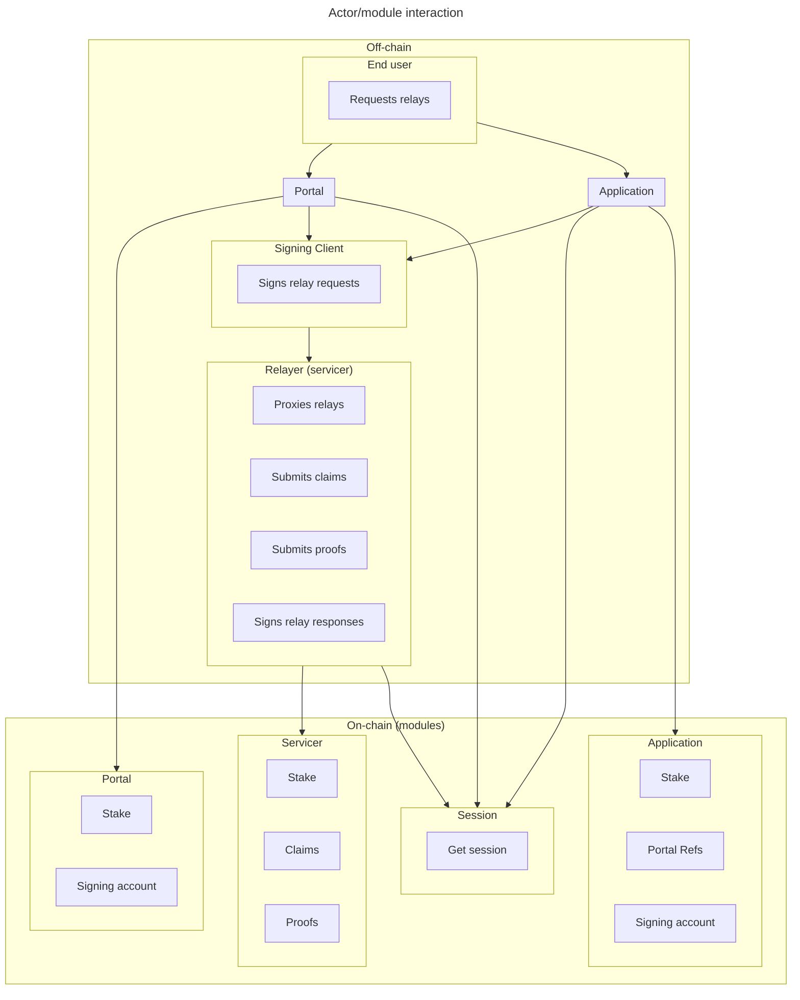

```mermaid
---
title: Actor/module interaction
---

flowchart

subgraph on["On-chain (modules)"]
    subgraph s[Servicer]
        s_s[Stake]
        s_c[Claims]
        s_p[Proofs]
    end

    subgraph se[Session]
        se_get[Get session]
    end

    subgraph aon[Application]
        a_s[Stake]
        a_a[Portal Refs]
				a_pk[Signing account]
    end

    subgraph pon[Portal]
        p_s[Stake]
        p_pk[Signing account]
    end
end

subgraph off["Off-chain"]
    subgraph r["Relayer (servicer)"]
        r_proxy[Proxies relays]
        r_claim[Submits claims]
        r_proof[Submits proofs]
        r_relay[Signs relay responses]
    end

    subgraph poff[Portal]
    end

    subgraph aoff[Application]
    end

    subgraph sc[Signing Client]
        sign[Signs relay requests]
    end

    subgraph eu[End user]
        eu_r[Requests relays]
    end
end


poff --> pon
poff --> sc
poff --> se
aoff --> sc
aoff --> se
aoff --> aon

sc --> r
r --> s
r --> se

eu --> poff
eu --> aoff
```
