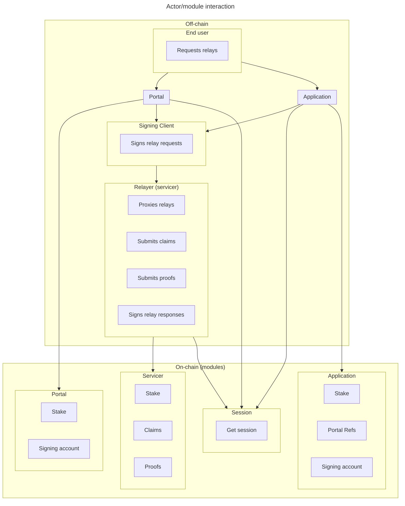
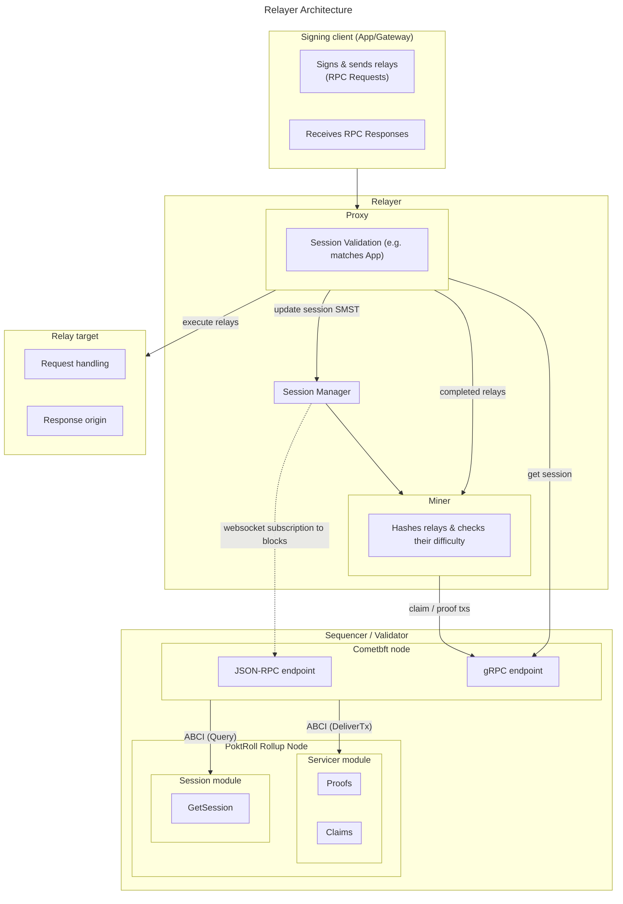

# Actors <!-- omit in toc -->

- [Actor Module Interaction](#actor-module-interaction)
- [Relayer Architecture](#relayer-architecture)

This document aims to show a high level diagram of Pocket Network actors and the interaction between them.

## Actor Module Interaction

This diagram gives an overview of the interaction between the various on/off chain actors.

## Relayer Architecture

This diagram gives an overview of the core business logic of a Relayer.

