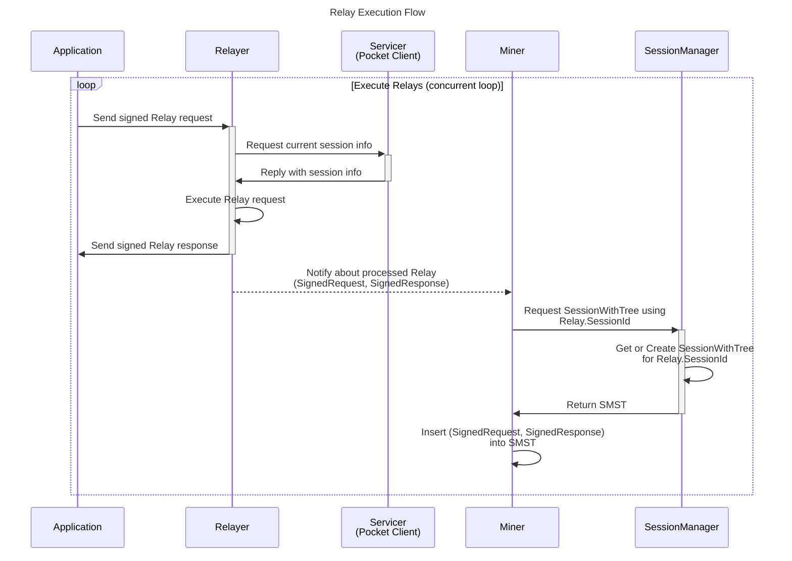
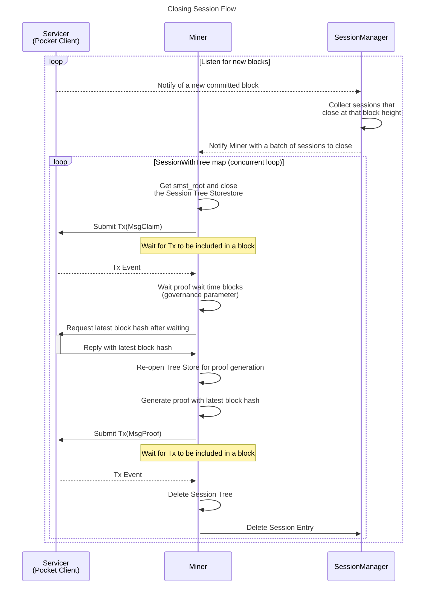

# Flows <!-- omit in toc -->

## Relay Execution Flow

This flow demonstrations the execution of a `Relay` from the `Application` to the `Miner`. It is a concurrent loop that executes relays in parallel.

`Relay`s are persisted in the `SMST` (Sparse Merkle Sum Tree) to be later included in the `Claim`/`Proof` lifecycle.

The `SessionManager` is a map of `SessionId` -> `SessionWithTree`.

The `SessionWithTree` is a struct that contains the `Session` and the `SMST` of executed `Relay`s.

## Session Execution Flow

This flow demonstrates the `Claim` & `Proof` lifecycle for `Session`s that are about to finish (i.e. close)

It is a concurrent loop that executes `Claim`/`Proof` submission in parallel across all `Session`s that are closing at the current block height.

