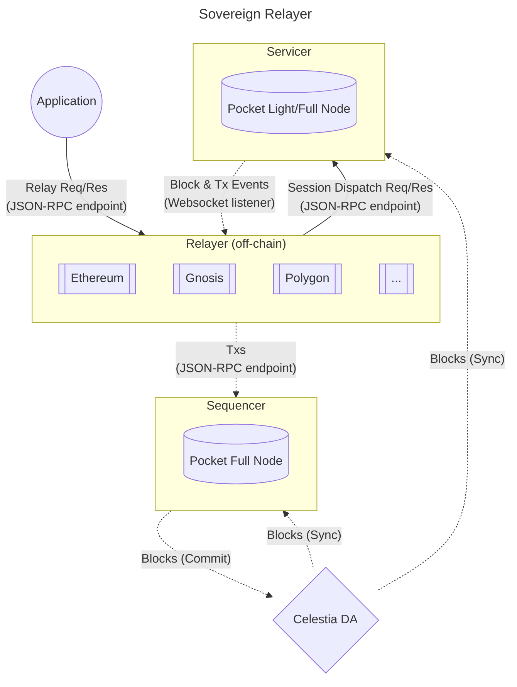
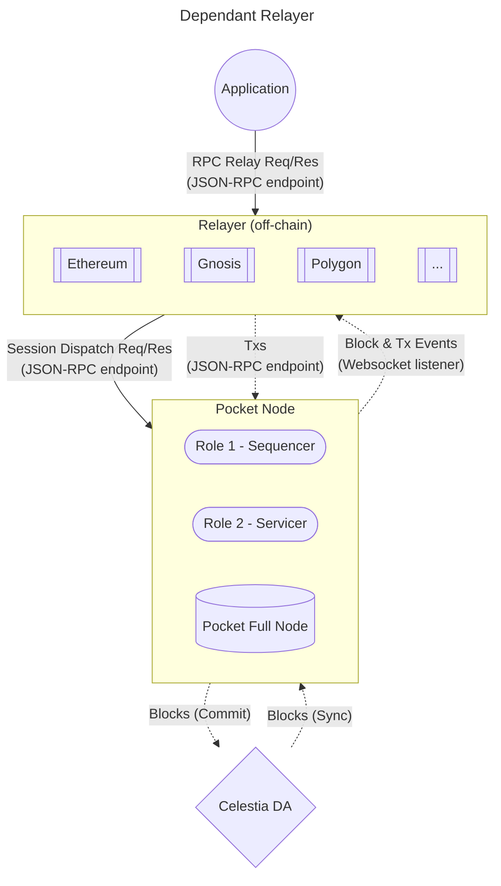

# Nodes <!-- omit in toc -->

- [Sovereign Relayer](#sovereign-relayer)
- [Dependant Relayer](#dependant-relayer)

This document aims to show a high level diagram of the nodes participating in the Pocket Rollkit Celestia network.

It includes the flow of Requests, Data, Transactions, and Blocks.

## Sovereign Relayer

A Sovereign Relayer is one that:

- Sends Txs to the sequencer
  - specified via `--sequencer-node`
- Runs it's own Pocket full/light client to:
  - read on-chain data
  - listen for on-chain events
  - specify via `--pocket-node` that is either on `localhost` or personally owned domain

_NOTE: The diagram below shows an example where `pocket-node != localhost` but assume it is on a domain owned by the relayer_

## Dependant Relayer

A Dependant Relayer is one that:

- Sends Txs to the sequencer
  - specified via `--sequencer-node`
- Trusts another node (sequencer or other party) to:
  - read on-chain data
  - listen for on-chain events
  - specify via `--pocket-node` that is not on a personally owned domain

_NOTE: The diagram below shows an example where `sequencer-node == pocket-node`_

