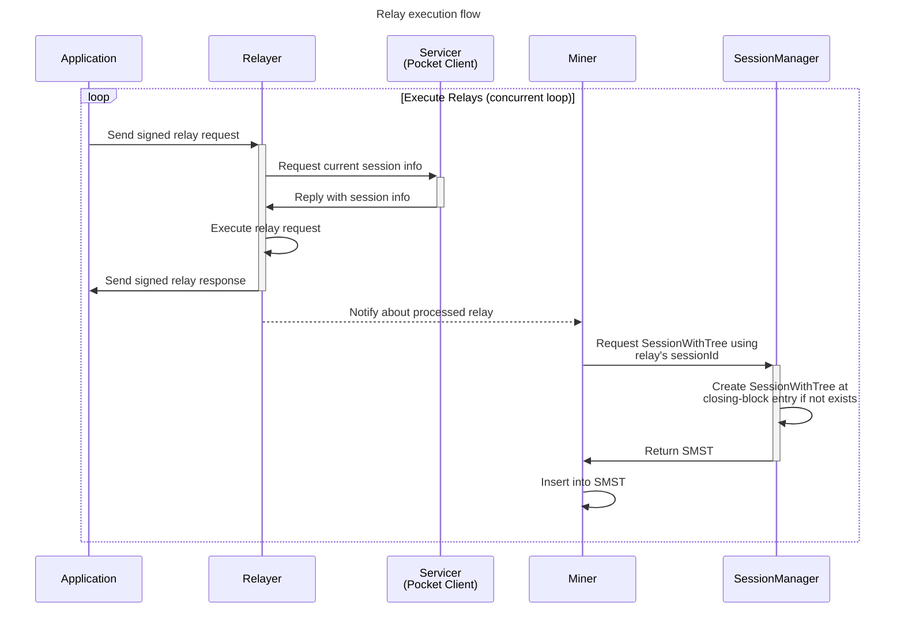

This document describes the flow of relay execution from the application to the miner. It is a concurrent loop that executes relays in parallel.

Relays are persisted into the SMST for later claim/proof generation. The SMST is a map of SessionId -> SessionWithTree.

The SessionWithTree is a struct that contains the Session and the SMST of the executed relays.

