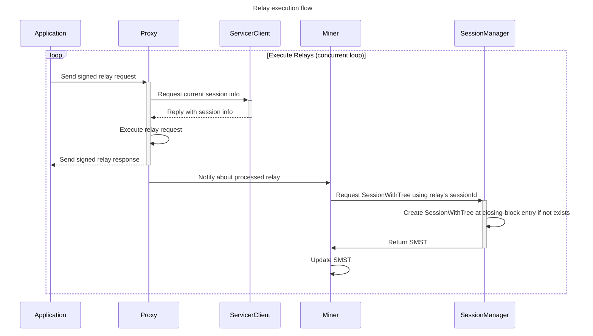

```mermaid
sequenceDiagram
  title: Relay execution flow
  participant Application
  participant Proxy
  participant ServicerClient
  participant Miner
  participant SessionManager

  loop Execute Relays (concurrent loop)
    Application ->>+ Proxy: Send signed relay request
    Proxy ->>+ ServicerClient: Request current session info
    ServicerClient -->>- Proxy: Reply with session info
    Proxy ->> Proxy: Execute relay request
    Proxy -->>- Application: Send signed relay response
    Proxy ->> Miner: Notify about processed relay
    Miner ->>+ SessionManager: Request SessionWithTree using relay's sessionId
    SessionManager ->> SessionManager: Create SessionWithTree at closing-block entry if not exists
    SessionManager ->>- Miner: Return SMST
    Miner ->> Miner: Update SMST
  end
```