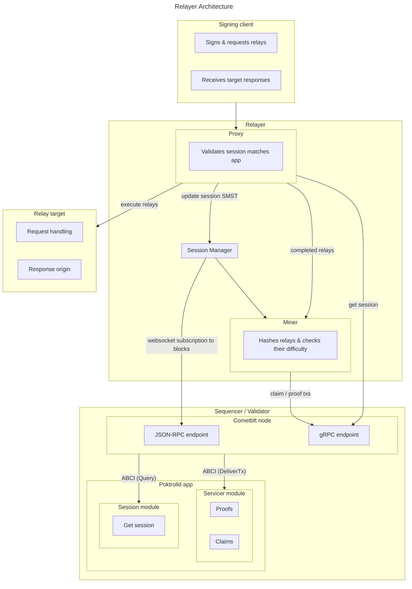

```mermaid
---
title: Relayer Architecture
---

flowchart

subgraph client[Signing client]
    signs[Signs & requests relays]
    c_res[Receives target responses]
end

subgraph rel[Relayer]
    subgraph proxy[Proxy]
        val_ses[Validates session matches app]
    end

    subgraph ses_man[Session Manager]
    end

    subgraph miner[Miner]
        dif[Hashes relays & checks their difficulty]
    end
end

subgraph target[Relay target]
    req[Request handling]
    res[Response origin]
end

subgraph seq["Sequencer / Validator"]
    subgraph comet[Cometbft node]
        comet_rpc[JSON-RPC endpoint]
        comet_grpc[gRPC endpoint]
    end

    subgraph app[Poktrolld app]
        %% subgraph grpcgw[gRPC gateway endpoint]
        %% end

        subgraph servicer[Servicer module]
            subgraph ser_claim[Claims]
                %% ser_val_ser[Validates signer matches servicer addr]
            end
            subgraph ser_proof[Proofs]
                %% ser_val_proof[Validates proof]
            end
        end

        subgraph session[Session module]
            ses_get[Get session]
        end
    end    
end

client --> proxy
proxy --"update session SMST"--> ses_man
proxy --"completed relays"--> miner
proxy --"execute relays"--> target
proxy --"get session"--> comet_grpc

ses_man --"websocket subscription to blocks"--> comet_rpc
ses_man --> miner

miner --"claim / proof txs"--> comet_grpc

%% grpcgw --> comet_grpc

comet --"ABCI (Query)"--> session
comet --"ABCI (DeliverTx)"--> servicer
```
