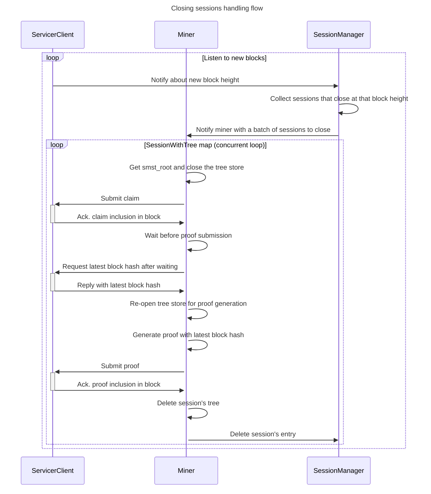

```mermaid
sequenceDiagram
  title: Closing sessions handling flow
  participant ServicerClient
  participant Miner
  participant SessionManager

  loop Listen to new blocks
      ServicerClient ->> SessionManager: Notify about new block height
      SessionManager ->> SessionManager: Collect sessions that close at that block height
      SessionManager ->> Miner: Notify miner with a batch of sessions to close

      loop SessionWithTree map (concurrent loop)
          Miner ->>+ Miner: Get smst_root and close the tree store
          Miner ->>+ ServicerClient: Submit claim
          ServicerClient ->>- Miner: Ack. claim inclusion in block
          Miner ->> Miner: Wait before proof submission
          Miner ->>+ ServicerClient: Request latest block hash after waiting
          ServicerClient ->>- Miner: Reply with latest block hash
          Miner ->> Miner: Re-open tree store for proof generation
          Miner ->> Miner: Generate proof with latest block hash
          Miner ->>+ ServicerClient: Submit proof
          ServicerClient ->>- Miner: Ack. proof inclusion in block
          Miner ->> Miner: Delete session's tree
          Miner ->> SessionManager: Delete session's entry
      end
  end
```