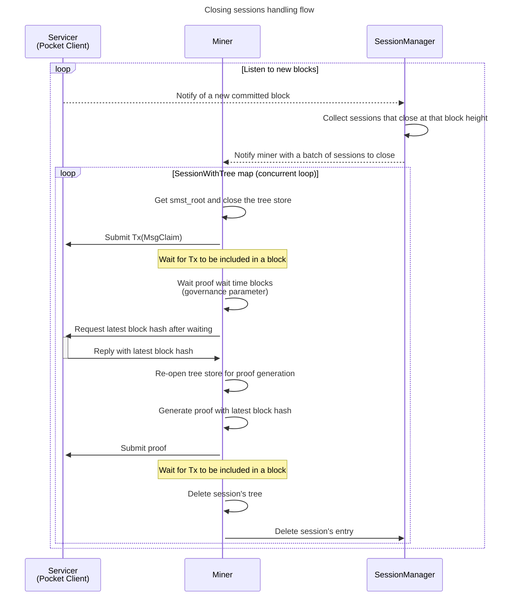

This document describes claim and proof generation for sessions that are closing.

It is a concurrent loop that executes the claim/proof submission in parallel across all sessions that are closing at the current block height.

